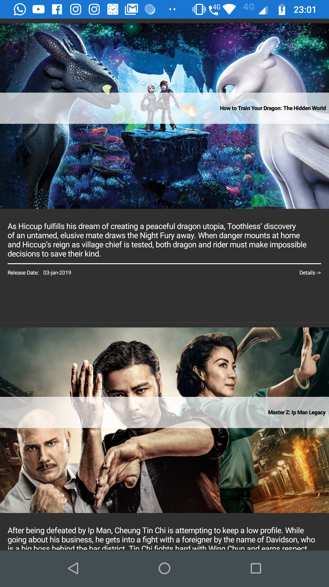
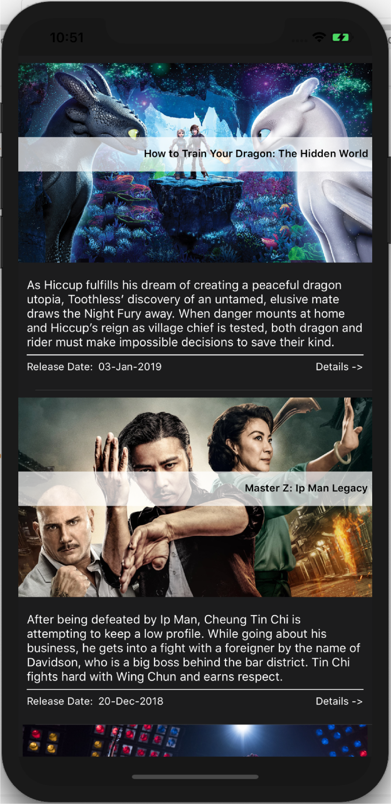

# umovie

The study Xamarin Project

## Packages

- Xamarin.FFImageLoading 2.4.5.870-pre
- Xamarin.FFImageLoading.Forms 2.4.5.870-pre
- Xamarin.Forms.Extended.InfiniteScrolling 1.0.0-preview2
- Xamarin.Forms.Theme.Base 1.0.0.43-pre1
- Xamarin.Forms.Theme.Dark 1.0.0.43-pre1
- Xamarin.Forms.Visual.Material 3.6.0.220655
- Xamarin.Forms 3.6.0.220655
- MVVMCoffee 1.0.0
- Refit 4.6.99

### Future

- Polly 
- Xamarin Essentials
- Akavache

# Prints

# Architecture (Basic)

The basic architecture has the following structure:

The screens are called Page and have a dependency of a ViewModel (name of the page with the suffix ViewModel). ViewModel communicates with services, which is responsible for orchestrating any needs beyond ViewModel's responsibility. However, Service classes abstract access to "Client" classes, which has the role of communicating with external services using the Refit package.

- The REFIT library was used to facilitate communication with REST services.
- The FFImageLoading library was used to produce the cache of the images loaded in the listing.
- The MVVMCoffee library has base implementations for using the MVVM model, as an implementation of an ObservableRangeCollection class, very useful for adding multiple items to the list without notifying each insert. In addition, the framework has an implementation of a model of navigation by ViewModels.
- Using the InfiniteScrolling framework facilitates infinite scroll implementation in the listview
- The other libraries only complement the application visually.

# Next steps

- Inclusion of a framework for resilience, among other needs (Poly).
- Inclusion of Xamarin.Essentials for use of important mechanisms such as Connectivity detection.
- Inclusion of detail page
- Inclusion of the Akavache framework to create cache